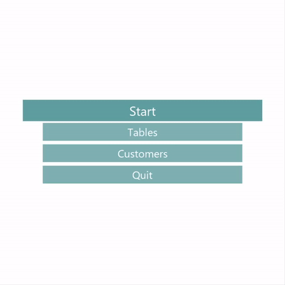
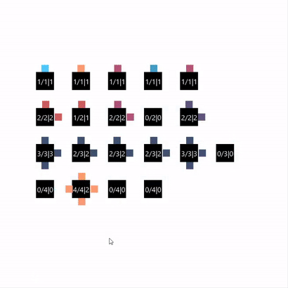

# Pizzeria problem
 Synchronous programming problem of a pizzeria
 
## Rules and assumptions:
 * each customer is represented by a different thread
 * program of an pizzeria owner and customers should optimize table assignment for maximum profit
 * program parameters should be easily changable
 * there are X1, X2, X3, X3 tables with respectively 1, 2, 3, 4 seats
 * groups of customers consist of 1, 2 or 3 customers.
 * group of customers can join a table only, when the table has enough free seats and is empty or occupied by an equipotent group of customers
 
 ### Graphical user interface grants you acces to management of count of tables with secified count of seats
 
 
 ### Preview of the program itself visualised, and changing of the customer group behaviour time parameters
 
